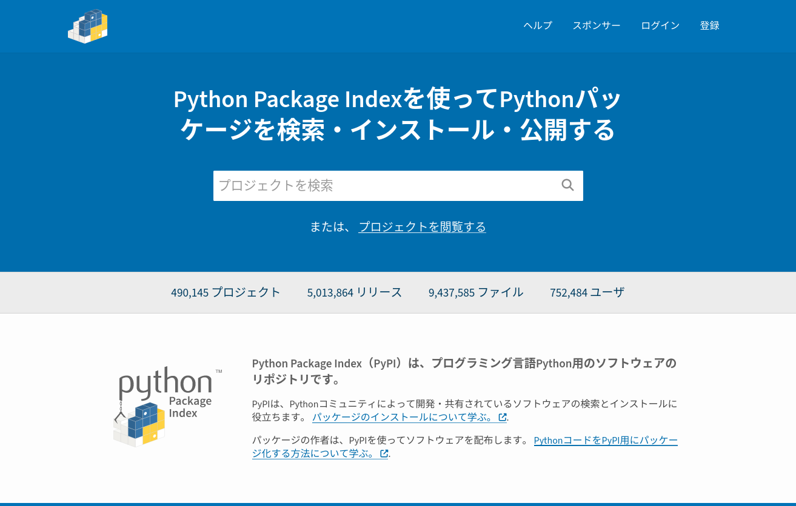

PythonパッケージとPyPI
======================

.. revealjs-notes:: 4min

とあるSphinx拡張（仮）
----------------------

.. code-block:: python

    from sphinx.application import Sphinx

    def setup(app: Sphinx):
        """拡張として読み込み時にprintをするだけ。
        """

        print("Let's build by Sphinx!")

Pythonにおけるモジュール/パッケージ
-----------------------------------

* スクリプト = Pythonコードが記述されたファイル
* モジュール = ``import`` による再利用を前提とした「スクリプト」
* パッケージ = 1個以上の「モジュール」の集まり

.. revealjs-fragments::

    …自分以外もパッケージを共有したい時がある

    …PyPIへアップロードしたくなる

PyPI
----

.. revealjs-break::

http://pypi.org/

* **Py** thon **P** ackage **I** ndex
* Pythonパッケージを公開するためのリポジトリサイト
* ``pip install`` で特に指定がない場合に、パッケージを見に行く第一候補
* `PSF(Python Software Foundation) <https://www.python.org/psf-landing/>`_ によって運用中

今日の目的
----------

* PyPIへ自作のライブラリをアップロードする道筋を知ること

.. revealjs-break::

* PyPIへ自作のライブラリをアップロードする道筋を知ること
* PyPIデビューをすること

.. revealjs-break::

* PyPIへ自作のライブラリをアップロードする道筋を知ること
* **GitHubを使った** 、楽なPyPIデビューをすること

.. revealjs-fragments::

    .. container:: flex

        .. container:: half

            .. container:: r-fit-text

                巨人の肩に乗ってゆけ

        .. container:: half

            .. figure:: _images/octcat.png
                :width: 80%
