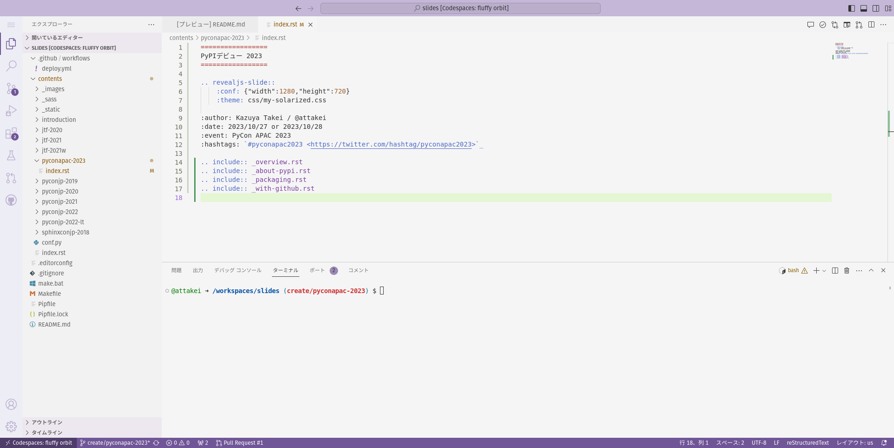
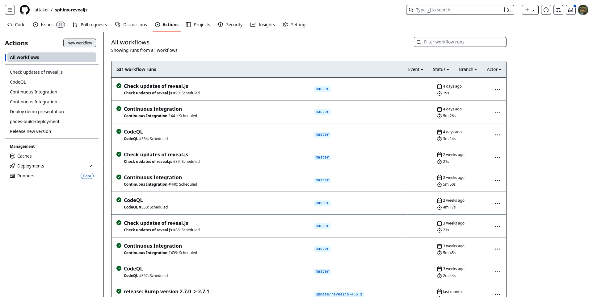
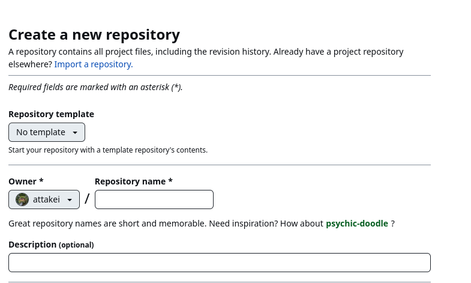

GitHubに乗りかかって開発する
============================

.. revealjs-notes:: 14min

基本的な流れ(おさらい)
----------------------

* (想起する)
* セットアップする
* 開発する
* テストする
* ドキュメントを書く
* パッケージングする
* アップロードする

基本的な流れ with GitHub
------------------------

* (想起する)
* セットアップする with GitHub
* 開発する with GitHub
* テストする with GitHub
* ドキュメントを書く with GitHub
* パッケージングする with GitHub
* アップロードする with GitHub

開発する with GitHub
--------------------

.. revealjs-break::

.. revealjs-break::

**GitHub Codespaces**

* GitHubがホスティングしているクラウド開発環境
* ブラウザ・端末を飛び越えて環境を共有できるのが強み
* 中身はVisual Studio Code

.. revealjs-break::

**GitHub Copilot**

* AIによる、プログラミング支援サービス
* (使ってないので、紹介だけ)

テストする with GitHub
----------------------

.. revealjs-break::

.. revealjs-break::

**GitHub Actions**

* GitHub提供のワークフロー基盤
* CI/CDなんでもござれ
* マニュアルバッチに定期処理

.. revealjs-break::

.. code-block:: yaml

    test:
      runs-on: ubuntu-latest
      strategy:
        max-parallel: 4
        matrix:
          python-version: [3.7, 3.8, 3.9, '3.10', '3.11']
          sphinx-version: ['>=3.0.0,<4.0.0', '>=4.0.0,<5.0.0', '>=5.0.0,<5.1.0', '>=5.1.0,<6.0.0', '==7.*']
          exclude:
            # Old major version does not support python>=3.10
            - python-version: '3.7'
              sphinx-version: '==7.*'
            - python-version: '3.10'
              sphinx-version: '>=3.0.0,<4.0.0'
            - python-version: '3.11'
              sphinx-version: '>=3.0.0,<4.0.0'

* ``matrix`` を使って、組み合わせテストが出来て便利
* ``exclude`` で特定条件の除外も可能
* ( `ref <https://github.com/attakei/sphinx-revealjs/actions/runs/6607604413>`_ )

.. revealjs-break::

.. code-block:: yaml

    on:
      push:
      pull_request:
      workflow_dispatch:
      schedule:
        - cron: '30 0 * * 1'

* ``on.push`` でPushのたびにテスト実行するのが基本
* ``on.schedule`` を登録しておくことで、未来に備えられる

  * 依存パッケージがいきなり後方互換を壊して登場する
  * 依存の依存パッケージが突然組み合わせ不全を起こす

* ``on.workflow_dispatch`` はいざというときのマニュアル実行

ドキュメントを書く with GitHub
------------------------------

.. revealjs-break::

.. revealjs-break::

**GitHub Actions**

* GitHub提供のワークフロー基盤
* CI/CDなんでもござれ
* マニュアルバッチに定期処理

.. container:: align-right

    2度目の登場

.. revealjs-fragments::

    | ↑ワークフロー処理として、ドキュメントのビルドが可能
    | ※ビルドだけだが…？

.. revealjs-break::

**GitHub Pages**

* 静的サイト配信基盤
* GitHub Actionsの過程で、楽にデプロイできるのが魅力
* ライブラリが育ちそうならRead the docsへの切り替えを推奨

パッケージングする with GitHub
------------------------------

.. revealjs-break::

.. revealjs-break::

**GitHub Actions**

* GitHub提供のワークフロー基盤
* CI/CDなんでもござれ
* マニュアルバッチに定期処理

.. container:: align-right

    3度目の登場

.. revealjs-fragments::

    ↑ワークフロー処理として、sdist,bdistの作成が可能

.. revealjs-break::

**GitHub Actions**

.. code-block:: yaml

    on:
      push:
        tags:
          - 'v*.*.*'

* 自分の場合は、タグPushをトリガーにしている
* 実行環境にWindows,macOSも選択可能なため、bdist作成に便利
* (余談)デスクトップアプリのビルドにも便利

.. revealjs-break::

**GitHub Releases**

* タグ等を使ったリリース状態保全
* PyPIがあれば基本的にそこまで強い出番がない
* …が、bdistのミラーサイト扱いにはできる
* GitHub Actionsの過程で、楽にデプロイできるのが魅力

アップロードする with GitHub
----------------------------

.. revealjs-break::

.. revealjs-break::

**GitHub Actions**

* GitHub提供のワークフロー基盤
* CI/CDなんでもござれ
* マニュアルバッチに定期処理

.. container:: align-right

    4度目の登場

.. revealjs-fragments::

    | ↑ワークフロー処理として、作成済みsdist,bdistのアップロードが可能
    | ※パッケージングと同じタイミング

GitHub Actionsの出番が多すぎる件
--------------------------------

* CLI処理なら割と何でもできるのが強い
* OSバリエーションも豊富
* | MarketPlaceのアクションが便利
  | 例: `Send Tweet Action <https://github.com/marketplace/actions/send-tweet-action>`_

セットアップする with GitHub
----------------------------

.. revealjs-break::

.. revealjs-break::

**リポジトリテンプレート機能**

* 大雑把に言えば「新規リポジトリ作成用の雛形リポジトリ」
* テンプレート側もリポジトリなので、メンテナンスしやすい
* GitHub-CLIからも指定できるのでありがたい
* ライブラリ作成をこなせばこなすほど意味を持ってくる

.. revealjs-break::

**(番外)cookiecutter**

* 同じくテンプレートから作成するCLIツール
* プロンプト経由で変数を引き渡せるので、リポジトリテンプレートより柔軟性がある
* (個人的には、こっちを使っている)
