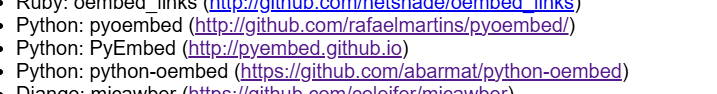

================
実践「OSS≒盆栽」
================

oEmbedPyを使って、ドキュメントに○○○を埋め込もう

.. revealjs-slide::
    :conf: {"width":1440,"height":1080}
    :theme: css/pyconjp-2025.css

:author: Kazuya Takei / @attakei
:date: (not yet)
:event: (PyCon JP 2025)
:hashtags:
    `#pyconjp2025 <https://twitter.com/hashtag/pyconjp2025>`_

Overview
========

About this prepresentation
--------------------------

This is proposal of PyCon JP 2025 lightning talks.
But it is defeated...

So, I don't talk about this anywhere yet.

Who am I ?
----------

.. container:: flex

    .. container:: two-of-third

        Kazuya Takei

        * attakei (X, GitHub, etc)
        * OSS Writer

            * Sphinx extensions
            * Client library

    .. container:: one-of-third

        .. figure:: https://attakei.net/_static/images/icon-attakei@2x.png
            :alt: 著者近影

I talked at Day 1
-----------------

https://slides.attakei.net/pyconjp-2025/

.. oembed:: https://slides.attakei.net/pyconjp-2025/

oEmbed
======

What is oEmbed ?
----------------

https://oembed.com/

  oEmbed is a format for allowing an embedded representation of a URL on third party sites.
  The simple API allows a website to display embedded content (such as photos or videos) when a user posts a link to that resource,
  without having to parse the resource directly.

Many providers!
---------------

https://oembed.com/providers.json

Bluesky, CodePen, Dailymotion, Docswell, Facebook, Gyazo,
Instagram, SlideShare, SpeakerDeck, YouTube, X, and more

Convenience
-----------

I can get embed HTML by API request.

Example: Using PyCon JP TV

https://www.youtube.com/watch?v=DnIi4qm_p7w

.. revealjs-break::

By manual

1. Open in browser https://www.youtube.com/watch?v=DnIi4qm_p7w .
2. Click "share".
3. Click "embed".

.. revealjs-break::

By oEmbed

1. Call `https://www.youtube.com/oembed?url={URL}`

.. code-block:: console

    $ uvx --from=httpie http \
        https://www.youtube.com/oembed \
        url=='https://www.youtube.com/watch?v=DnIi4qm_p7w' | jq -r '.html'

    <iframe
        width="200"
        height="113"
        src="https://www.youtube.com/embed/DnIi4qm_p7w?feature=oembed"
        frameborder="0"
        allow="accelerometer; autoplay; clipboard-write; encrypted-media; gyroscope; picture-in-picture; web-share"
        referrerpolicy="strict-origin-when-cross-origin"
        allowfullscreen
        title="PyCon JP TV #56: PyCon JP 2025の楽しみ方">
    </iframe>

oEmbedPy
========

"Morden" oEmbed Python client
-----------------------------

* Return dataclass object
* Support https://oembed.com/providers.json
* Support auto discovery
* Integration for document builder

Usage
-----

.. literalinclude:: demo.py
    :language: python

.. revealjs-break::

.. code-block:: console

    uvx --from='oembedpy[cli]' oembed.py https://www.youtube.com/watch?v=DnIi4qm_p7w
    Installed 15 packages in 172ms
    type:             video
    version:          1.0
    html:             <iframe width="200" height="113" src="https://www.youtube.com/embed/DnIi4qm_p7w?feature=oembed" frameborder="0" allow="accelerometer; autoplay; clipboard-write; encrypted-media; gyroscope; picture-in-picture; web-share" referrerpolicy="strict-origin-when-cross-origin" allowfullscreen title="PyCon JP TV #56: PyCon JP 2025の楽しみ方"></iframe>
    width:            200
    height:           113
    title:            PyCon JP TV #56: PyCon JP 2025の楽しみ方
    author_name:      PyCon JP
    author_url:       https://www.youtube.com/@PyConJP
    provider_name:    YouTube
    provider_url:     https://www.youtube.com/
    cache_age:        None
    thumbnail_url:    https://i.ytimg.com/vi/DnIi4qm_p7w/hqdefault.jpg
    thumbnail_width:  480
    thumbnail_height: 360

Integration for document
------------------------

Sphinx integration

.. code-block:: python
    :caption: conf.py

    extensions = [
        "oembedpy.adapters.sphinx",
    ]

.. revealjs-break::

Sphinx integration

.. code-block:: rst
    
    .. oembed:: https://www.youtube.com/watch?v=DnIi4qm_p7w
        :maxwidth: 960
        :maxheight: 640

.. oembed:: https://www.youtube.com/watch?v=DnIi4qm_p7w
    :maxwidth: 960
    :maxheight: 640

.. revealjs-break::

Sphinx integration

.. code-block:: rst

    .. oembed:: https://x.com/pyconjapan/status/1971471046692807040
        
.. oembed:: https://x.com/pyconjapan/status/1971471046692807040

.. revealjs-break::

Sphinx integration

.. code-block:: rst

    .. oembed:: https://bsky.app/profile/attakei.dev/post/3lzmykxlsmc2s        

.. oembed:: https://bsky.app/profile/attakei.dev/post/3lzmykxlsmc2s

.. revealjs-break::

Q: **I don't use Sphinx!!!**

.. revealjs-fragments::

    A: **OK, do you use MkDocs?**

.. revealjs-break::

MkDocs Integration

.. code-block:: yaml
    :caption: config.yaml

    plugins:
      # - oembedpy
      - oembedpy:
        fallback_type: true

.. revealjs-break::

MkDocs Integration

.. code-block:: markdown

    ```oembed
    https://bsky.app/profile/attakei.dev/post/3lzmykxlsmc2s
    ``` 

.. oembed:: https://bsky.app/profile/attakei.dev/post/3lzmykxlsmc2s

Why did I make it ?
===================

There are already python implementations
----------------------------------------



.. revealjs-break::
    :notitle:

`pyoembed <https://github.com/rafaelmartins/pyoembed/>`_

* Last update is 8 years ago
* Classifier is Python 2 only!!

.. container:: content-right flip-horizontal

    :nekochan:`uchu-neko-nya;3em`

.. revealjs-break::
    :notitle:

`pyembed <https://github.com/pyembed/pyembed/>`_

* Last update is 5 years ago
* Classifier is Python 2 and Python 3.3!!

.. container:: content-right flip-horizontal

    :nekochan:`uchu-neko-nya;3em`
    :nekochan:`uchu-neko-nya;3em`

.. revealjs-break::
    :notitle:

`python-oembed <https://github.com/abarmat/python-oembed>`_

* Last update is 9 years ago
* Classifier is Python 2.5, 2.6 and 3.4!!

.. container:: content-right flip-horizontal

    :nekochan:`uchu-neko-nya;3em`
    :nekochan:`uchu-neko-nya;3em`
    :nekochan:`uchu-neko-nya;3em`

.. revealjs-break::
    :notitle:

.. container:: content-center

    .. nekochan:: scream-nya
        :height: 5em

    Any libraries already stopped maintenance!!

What do you do if there is not lib matched for you ?
----------------------------------------------------

.. revealjs-fragments::

    .. container:: r-fit-text

        We can make it !!

Thank you
=========

attakei/oEmbedPy