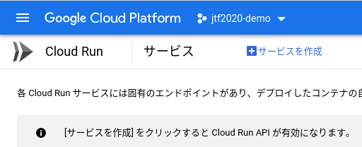
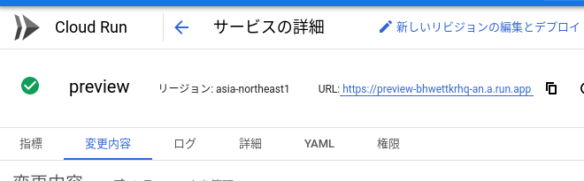
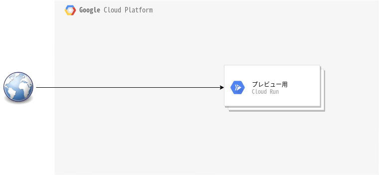
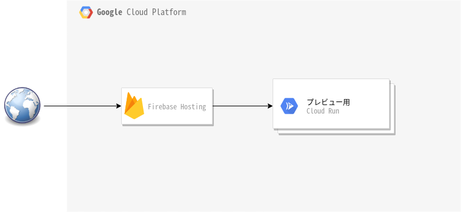
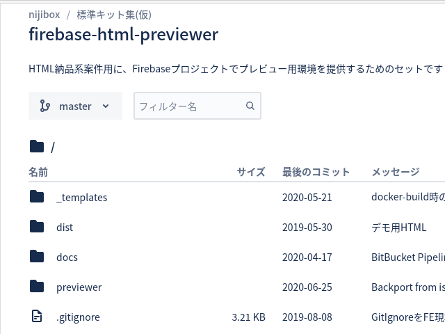
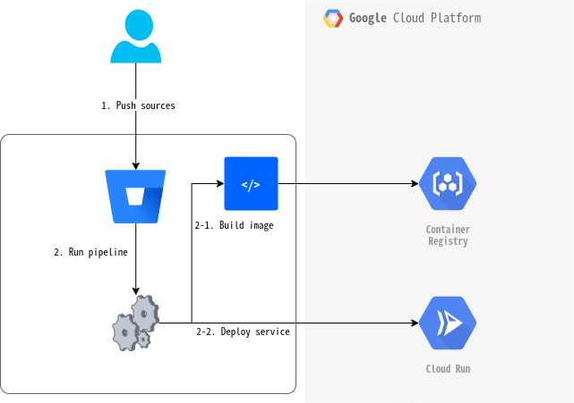

=============================================================
Web制作において、プレビューにあえてCloudRun(とFirebase)を使う
=============================================================

.. revealjs-slide::
    :theme: css/my-solarized-nijibox.css

:date: 2020-07-25
:author: Kazuya Takei
:location: July Tech Festa 2020
:links: `Twitter(all) <https://twitter.com/hashtag/JTF2020?src=hashtag_click&f=live>`_ `Twitter(track) <https://twitter.com/hashtag/JTF2020F?src=hashtag_click&f=live>`_, `Sli.do <https://app.sli.do/event/flnldghv/live/questions>`_

イントロ
========

自己紹介
--------

.. container:: flex

    .. container:: two-of-third

        Kazuya Takei

        * NIJIBOX Co., Ltd
        * Server-side engineer

        @attakei

        * Pythonista
        * sphinx-revealjs and more

    .. container:: one-of-third

        .. figure:: https://attakei.net/_static/images/icon-attakei@2x.png

NIJIBOX について
----------------

.. image:: ../_images/nijibox/logo-nijibox.svg
    :width: 80%

| 株式会社ニジボックスは、UXデザインに特化した、リクルートグループのWeb制作会社です。
| 新規事業の立ち上げ支援、UXデザイン、UIデザイン、Web制作、開発、動画制作、イラスト制作、リリース後のグロースハックまで、一気通貫でサポートしています。

話すこと(目標)
--------------

* Web制作における「プレビュー」
* Cloud Runで作るプレビュー環境
* Cloud Runの意義/制約
* 実運用での話題共有

話さないこと
------------

* 構築の中身の実践論の細かい話

  * スライド自体には多少含まれていますが、トークはざっくりになります
  * ※興味がある方は、問い合わせください |:bow:|

Web制作における「プレビュー」
=============================

背景
----

* | ニジボックスは、UXコンサルティングと
  | **Web制作の会社**
* | 制作物の最終納品より前に、クライアントに
  | 内容確認をしてもらっている
* | より実態に即した内容で確認してもらうために、
  | 社内で用意している環境を **「プレビュー環境」** という

.. revealjs-break::

※補足として

* 今回は、LPといった静的サイト案件の話
* Webアプリケーション系はスコープ外

.. revealjs-break::
    :notitle:

|
|

では、プレビュー環境を用意しましょう

|

...どこに？

プレビュー環境の選択肢
----------------------

.. LPはバックエンドに細かい条件が不要のため、選択肢の幅が割とある

* レンタルサーバー
* VPS
* IaaSのインスタンス
* その他

選択肢: レンタルサーバー
------------------------

.. FTP/Apache/100円程度で利用可能

古くからあるサーバーを共用する契約

* |:grinning:| 良い点

  * 開始が手軽
  * 安い
  * htaccess使える(ことが多い) = アクセス制御が可能

* |:thinking_face:| 微妙な点

  * 複数案件に弱い(サブフォルダ問題)
  * 認証情報が少ない(アップロード側）

選択肢: VPS/IaaSのインスタンス
------------------------------

.. FTP/Apache/500円〜

単一の仮想マシンを利用する契約

* |:grinning:| 良い点

  * 柔軟性が強い
  * (アクセス制限/VirtualHost)

* |:thinking_face:| 微妙な点

  * 色んな意味でコスパがあまりよろしく無い
  * (値段/手間)

選択肢: ここまでまとめ
----------------------

| レンサバ、VPS、インスタンス
| 　∈ サーバー運用

* 金銭面でのランニングコストがかかる
* サーバー管理が必要になる（負荷度合いは、運用次第）

.. revealjs-fragments::

    .. container::

        **↓**

        | **インフラ系リソースが少ないと、**
        | **なんとも言えない感じになる**

.. revealjs-break::
   :notitle:

.. container:: stronger-one-sentence

    | サーバーレス構成にすれば
    | 良いんじゃね！？

サーバーレスな例
----------------

.. Netlifyの有料プランはBasic認証可能だが$45/月->$19/月

.. revealjs-fragments::

    * | S3に配置して、CloudFrontを基盤にアクセス制御する？
      | ... そこそこ手間がかかる
    * | Netlifyの有料プラン使う？
      | ... なお値段
    * | HerokuのHobbyプラン
      | ... ありかもしれない
    * **Cloud Runを使ってみようか？**

Cloud Runで作るプレビュー環境
=============================

Google Cloud Runとは
--------------------

  コンテナ化されたアプリケーションをすばやく安全にデプロイ、スケーリングできる、フルマネージド型のコンピューティング プラットフォーム

(Cloud Runのトップページより)

.. revealjs-break::

要するに =

「割と気軽に」「コンテナWebアプリの実行を」「ドメイン付きで」実現するサービス

3行で説明するCloud Runの使い方
------------------------------

* GCPの契約をして、プロジェクトで必要なサービスを有効化する
* ローカルでDockerアプリを開発してから、イメージをpush
* サービスを起動する

Cloud Runの使い方
-----------------

GCPの契約をして、プロジェクトで必要なサービスを有効化する

* 普通に使うだけ
* Cloud Runを有効にした時点で、最低限必要なサービスも自動で有効になる

.. revealjs-break::

ローカルでDockerアプリを開発してから、イメージをpush

* アプリと書いたけど、Apache+静的コンテンツでも立派なアプリ
* ``Dockerfile`` の時点で、全コンテンツを追加
* アクセス制御の仕組みを突っ込めばOK
* ローカルでDockerアプリを開発してから、イメージをpush

.. revealjs-break::

.. literalinclude:: _snippets/Dockerfile
    :caption: これでも十分なDockerアプリ
    :language: docker

.. revealjs-break::

サービスを起動する

* 正しくDockerコンテナが起動したら、FQDNがもらえる
* おめでとうございます！これでプレビュー環境の出来上がりです！

図解
----

.. revealjs-fragments::

    .. container::

        .. container::

            .. figure:: _images/flow-deployment_basic.png

        .. container::

            全てGCPでやる感じだと、こう

            .. figure:: _images/flow-deployment_full_gcp.png

「プレビュー環境」の構成図
--------------------------

.. ...Firebaseは？

.. revealjs-break::

https://firebase.google.com/docs/hosting/cloud-run?hl=ja

..
    * 実態としては、Firebase Hostingを間に挟んでる
    * 間にいるだけで、基本的にはほぼ何もしていない
    * それでも間に立ってる理由は後述

Cloud Run(+Firebase)の意義/制約
===============================

要約で再掲: プレビュー環境をサーバー運用すると
----------------------------------------------

* 金銭面でのランニングコスト
* サーバー管理の必要性

Cloud Runを使うと...
--------------------

* 安い(基本的にリクエスト依存の課金のため)
* アクセス制御が割合柔軟
* GCPプロジェクトを削除すれば、そのまま環境破棄できる
* FQDNを自動で付与してくれる

Cloud Run+Firebaseを使うと...
-----------------------------

* 安い(基本的にリクエスト依存の課金のため)
* アクセス制御が割合柔軟
* GCPプロジェクトを削除すれば、そのまま環境破棄できる
* **非常にわかりやすい** FQDNを自動で付与してくれる

付与されるFQDN
--------------

* Cloud Run

  * ``{サービス名+ランダムな文字列}.a.run.app``

* Firebase Hosting

  * ``{プロジェクトID}.firebaseapp.com``
  * ``{プロジェクトID}.web.app`` **<- わかりやすい**

Cloud Runの制約
---------------

* 「コンテンツをリアルタイムで編集」みたいなのは向かない
* 運用に、ある程度Dockerの知識が必要
* DDoS攻撃受けると怖い

実運用での話題共有
==================

弊社では...
-----------

ボイラープレートをあらかじめ用意

* Cloud Runの有効化→デプロイまでを一括実行するCIパイプライン
* 前述の環境を提供するアプリケーション
* その他必要なファイルなど

制作メンバーはFirebaseプロジェクトを用意して、
ボイラプレートを利用するだけで、簡単に環境を増やせる。

.. revealjs-break::

#. Member: @attakei Firebaseプロジェクト下さい。IDはXXXXXで
#. Takei: @member 作りました。権限付与したので、よしなにどうぞ
#. Member: 了解ですー
#. Member作業中...
#. Member: @here プレビュー環境準備しました。URLはこちら

.. revealjs-break::

.. revealjs-break::

コスト事情
----------

* だいたい、10円/月・案件ぐらいが目安
* 重めのリソースを持ってても、月間全体で100円行くことはまず無い

まとめ
======

Cloud Runを使った「プレビュー環境」を運用してます
-------------------------------------------------

* 環境用意から破棄までが容易になった
* Webアプリじゃなくても、CLIじゃなくても、Dockerは使える
* 「Docker環境をちょっと運用してみたい」、そんな人の一助となれば

参考リンクなど
--------------

* 今回の主役となるGCPサービス

  * https://cloud.google.com/run
  * https://cloud.google.com/container-registry/
  * https://firebase.google.com/docs/hosting/cloud-run?hl=ja

.. revealjs-break::

* 弊社のコーポレートサイト

  * https://nijibox.jp

* このスライドに使ってるライブラリ/サービス

  * https://www.sphinx-doc.org/
  * https://sphinx-revealjs.readthedocs.io/
  * https://revealjs.com/
  * https://www.diagrams.net
