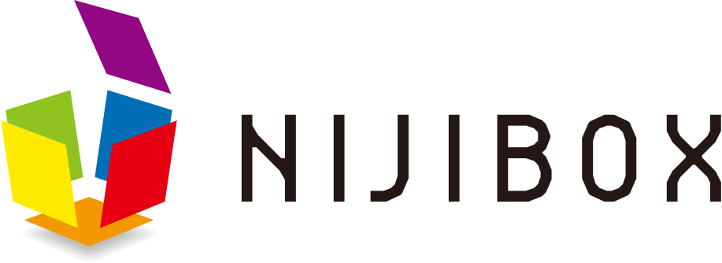
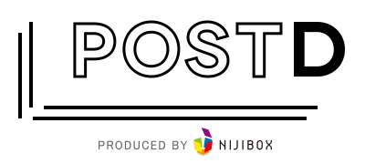

イントロ
========

|:blue_square:| > |:blue_square:| > |:blue_square:| > |:blue_square:|

自己紹介
--------

.. Pythonista周りの話は1枚めでちょっと触れる

.. container:: flex

    .. container:: two-of-third

        Kazuya Takei

        * NIJIBOX Co., Ltd
        * サーバーサイドエンジニア
        * アーキテクト

        @attakei as 雑食系エンジニア

        * `Twitter <https://twitter.com/attakei>`_
        * `GitHub <https://github.dom/attakei/>`_
        * and more

    .. container:: one-of-third

        .. figure:: https://attakei.net/_static/images/icon-attakei@2x.png

NIJIBOX について(AD)
--------------------

| 株式会社ニジボックスは、UXデザインに特化した、リクルートグループのWeb制作会社です。
| 新規事業の立ち上げ支援、UXデザイン、UIデザイン、Web制作、開発、動画制作、イラスト制作、リリース後のグロースハックまで、一気通貫でサポートしています。

.. revealjs-break::

`POSTD <https://postd.cc/>`_

- 海外のテクノロジー系記事を日本語で読むことができるエンジニア向けのキュレーションメディア
- 株式会社ニジボックスが運営を引き継ぎ再始動

トーク内容
----------

  多くのソフトウェアがコア+プラグインという構造を取っています。
  この「プラグイン」は、「コアを土台にすることによる軽量な実装」「機能x機能というジャンルによるピンポイントな需要の取りやすさ」などからOSS活動の実装系はじめの一歩として熟れたものとなっています。

  普段ちょこちょこプラグイン系ライブラリを書いている際にどんなことを考えるかを通じて、OSS活動の小さな一歩を踏んでみませんか？

※提出当時のCfP

.. revealjs-break::

.. 

  多くのソフトウェアがコア+プラグインという構造を取っています。
  この「プラグイン」は、「コアを土台にすることによる軽量な実装」「機能x機能というジャンルによるピンポイントな需要の取りやすさ」などから **OSS活動の実装系はじめの一歩として熟れたものとなっています。**

  普段ちょこちょこプラグイン系ライブラリを書いている際にどんなことを考えるかを通じて、 **OSS活動の小さな一歩を踏んでみませんか？**

※提出当時のCfP

主に話すこと
------------

- プラグインとは何か
- プラグイン開発がOSS活動の一歩目に向いている理由
- プラグイン開発時に自分が考えていること・見ていること
