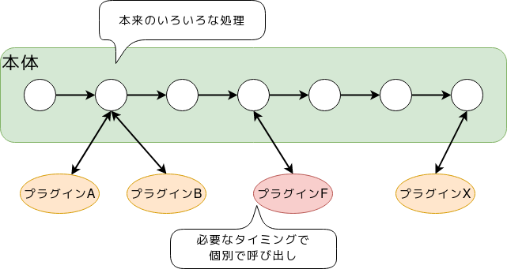
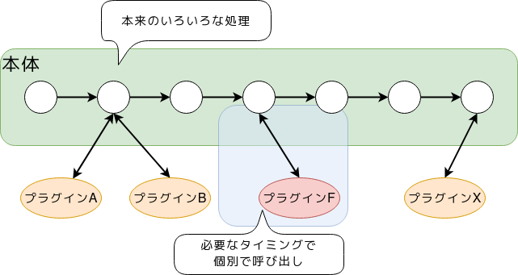
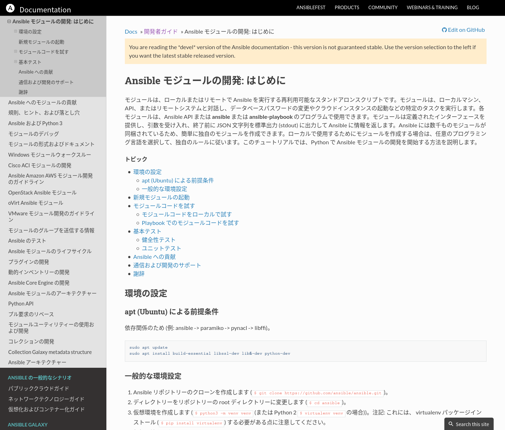
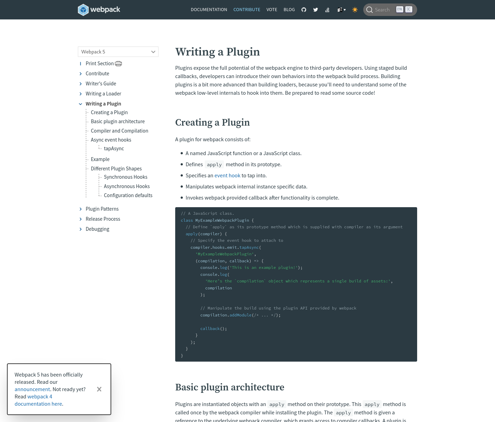

「プラグイン」がOSS活動に向いている？
=====================================

.. 6min

|:ballot_box_with_check:| > |:ballot_box_with_check:| > |:blue_square:| > |:blue_square:| > |:blue_square:|

プラグインの特徴振り返り
------------------------

* アプリケーションに機能を追加するナニカ
* アプリケーションが存在することが前提
* 機能自体の大小は問わないが、基本的に小さな機能でも良い

プラグインの特徴から見た、OSS活動入門との親和性
-----------------------------------------------

* コンパクトな実装でOSSとして成立する
* 自分の『不』を手軽に解消するトレーニングになりうる
* 質のいいコード・ドキュメントのリーディング機会が増える

コンパクトな実装でOSSとして成立する
-----------------------------------

よくあるプラグインの「振る舞い」

.. revealjs-break::

よくあるプラグインの「振る舞い」

.. revealjs-break::

プラグインが持つ最低限の責務

* 本体とのI/Oルールに基づいた、処理の定義を行う
* (いつ呼ばれるべきかを指定する)

.. revealjs-fragments::

    **非常にシンプル** (実際にはもうちょっとあることが多い)

.. revealjs-break::

`sphinxcontrib-gtagjs`

* Sphinx本体が「HTMLを生成するタイミング」で呼び出されて
* 「Googleのグローバルサイトタグを生成して」引き渡す

`ソースは45行（本質的な箇所は非常に少ない） <https://github.com/attakei/sphinxcontrib-gtagjs/blob/master/sphinxcontrib/gtagjs.py>`_

.. revealjs-break::

...ちなみに

* コンパクトな実装のためには、適度な分割をする
* 分割すると、数をこなせるようになる
* 数をこなすと、OSS活動のいいトレーニングになる

質のいいコード・ドキュメントのリーディング機会が増える
------------------------------------------------------

プラグインを作るには、**本来の処理の情報 + プラグインを呼ぶ本体の情報** が必要。

.. revealjs-break::

プラグインを作るには、**本来の処理の情報 + プラグインを呼ぶ本体の情報** が必要。

本体の情報 = ドキュメント+ソースコードを読む

* ドキュメントの充実度合いが高い（特にエンジニア向けプロダクト）
* こういうプロダクトはソースコードも読みやすい
* ↑リーディング機会が増加する

.. revealjs-break::

.. revealjs-break::

