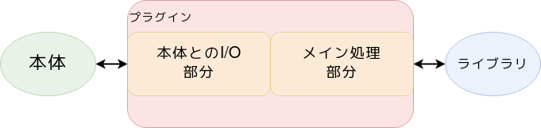

「プラグイン開発」のアプローチ
==============================

.. 13min

|:ballot_box_with_check:| > |:ballot_box_with_check:| > |:ballot_box_with_check:| > |:blue_square:|

どこから実装の手をつけるか問題
------------------------------

どっちから手を付ける？

.. revealjs-fragments::

   .. container::

    - I/Oのほうが本体連動させやすい
    - メイン処理のほうが独立して動作確認しやすい

.. revealjs-break::

どっちから手を付ける？

- I/Oのほうが本体連動させやすい
- **メイン処理のほうが独立して動作確認しやすい** ←個人的にはこっち

.. revealjs-break::

どこから手を付ける？

- I/Oのほうが本体連動させやすい
- **メイン処理のほうが独立して動作確認しやすい** ←個人的にはこっち

※いくつか作ると結果的にI/Oが先に出来るようになる

何を参考にするか問題
--------------------

* 本体ドキュメント(+ソース)
* 本体同梱プラグインのソース
* **「プラグインを作ってみた」系の記事**
* **サードパーティ製プラグインのソース**

本体ドキュメントを参考にする
----------------------------

* プラグインの重要度が高いと、専用のセクションもある
* プラグイン開発に関するドキュメントの充実度は、千差万別
* 「困った時には原典に当たる」精神を忘れずに

本体同梱プラグインを参考にする
------------------------------

* 主要になりうる機能プラグインは、同梱物を直接参照できる場所にある
* リファレンス実装ではないナニカとなっている
* | 同梱 = 本体開発者のお手製という傾向が強く、
  | 本体設計を暗黙知として実装している可能性があるので要注意

「プラグインを作ってみた」系の記事を参考にする
----------------------------------------------

* いわゆる、Zenn・Qiita・ブログにある記事
* 本体開発元と関係が深い組織が公開しているケースもあり、良いチュートリアルになる
* UGC系は一般ユーザー視点で、躓きドコロを紹介してくれたりもする

サードパーティ製プラグインを参考にする
--------------------------------------

* 未来の自分と同じく「困り手」によって作られている
* ドキュメントを元に素直な実装をしていることがしばしば
* GitHub starsの多いプラグインは、それ自体がリファレンス実装とも言える
