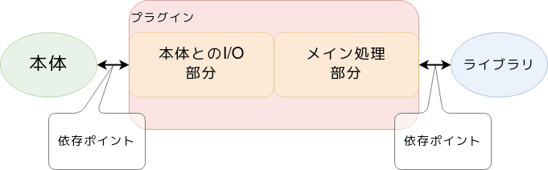

ちょっとした小話
================

.. 20min

|:ballot_box_with_check:| > |:ballot_box_with_check:| > |:ballot_box_with_check:| > |:blue_square:|

プラグイン開発にはアンテナが必要
--------------------------------

.. image:: _images/plugin-overview.png
    :width: 70%
    :align: center

.. revealjs-break::

2方面の状況に気を使う必要がある

* 本体の更新状況
* メイン処理のライブラリの更新状況

.. revealjs-break::

``sphinx-revealjs`` の安定的な更新管理のためには

* Sphinxの更新への追従
* Reaveal.jsの定期的な最新版取り込み

