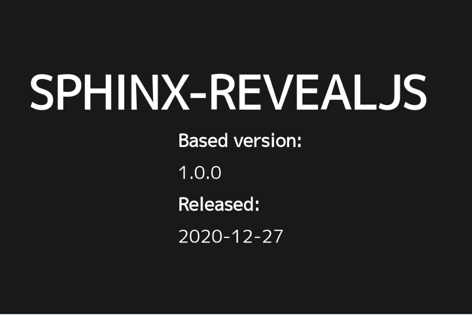
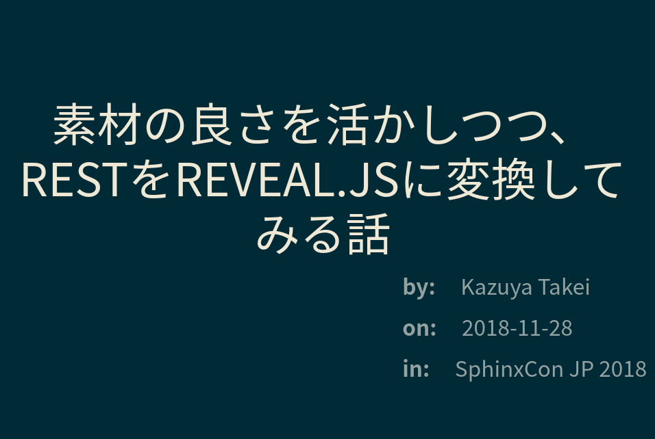

SphinxとReveal.js
=================

.. role:: strike

.. 7.5min

|:ballot_box_with_check:| > |:ballot_box_with_check:| > |:arrow_right:|

Reveal.js
---------

.. figure:: https://camo.githubusercontent.com/67ab0dc35ff7b5c57c210baeb98b60f2618166f629172b278dbb6e394a0a1e10/68747470733a2f2f68616b696d2d7374617469632e73332e616d617a6f6e6177732e636f6d2f72657665616c2d6a732f6c6f676f2f76312f72657665616c2d626c61636b2d746578742e737667
    :width: 50%

http://revealjs.com/

多機能な、HTMLプレゼンテーション用のフレームワーク

こんなことができる
------------------

* 縦横遷移による、ネストされたセクションの表現
* 様々なページ遷移アニメーション
* PDFエクスポート機能
* プラグインによる拡張

  * 数式サポート
  * シンタックスハイライト
  * スピーカーノート
  * :strike:`Markdownソースの直接変換`

HTMLプレゼンを使うためのSphinx拡張集(再掲)
------------------------------------------

* ``hieroglyph``
* ``sphinxjp.themes.gopher``
* ``sphinxjp.themes.impressjs``
* ``sphinxjp.themes.reveajs``
* ``sphinxjp.themes.s6``
* **sphinx-revealjs <= 作った**

sphinx-revealjs
---------------

https://github.com/attakei/sphinx-revealjs

* 作りました（最近、ver1.0に）
* Markdownプラグインに近い感覚で、RSTをReveal.jsプレゼンにする拡張
* 基本機能は揃ってる...はず

  * 階層によるネストされたセクション
  * テーマの切り替え
  * プラグインの呼び出し

* Reveal.jsと競合しない範囲で、既存のSphinx拡張を使い回せる

.. revealjs-break::

このスライド1枚目のサンプル(ソース)

.. code-block:: rst

    ================================
    プレゼン？それもSphinxで出来るよ
    ================================

    -ドキュメントツールSphinxのちょっと変わった利用法-

    :Date: 2021/1/24
    :Author: `Kazuya Takei <https://attakei.net>`_
    :Event: `July Tech Festa 2021 winter <https://techfesta.connpass.com/event/193966/>`_
    :Hashtag: `#jtf2021w_d <https://twitter.com/hashtag/jtf2021w_d>`_

    .. include:: _sections/introduction.rst

.. revealjs-break::

このスライド1枚目のサンプル(HTML)

.. code-block:: html

    <section >
      <h1>プレゼン？それもSphinxで出来るよ</h1>
      
-ドキュメントツールSphinxのちょっと変わった利用法-

      <dl class="field-list simple">
        <dt class="field-odd">Date</dt>
        <dd class="field-odd">
2021/1/24

        </dd>
        <dt class="field-even">Author</dt>
        <dd class="field-even">
<a class="reference external" href="https://attakei.net">Kazuya Takei</a>

        </dd>
        <dt class="field-odd">Event</dt>
        <dd class="field-odd">
<a class="reference external" href="https://techfesta.connpass.com/event/193966/">July Tech Festa 2021 winter</a>

        </dd>
        <dt class="field-even">Hashtag</dt>
        <dd class="field-even">
<a class="reference external" href="https://twitter.com/hashtag/jtf2021w_d">#jtf2021w_d</a>

        </dd>
      </dl>
    </section>

.. revealjs-break::

デモをどうぞ

=> https://attakei.github.io/sphinx-revealjs

.. revealjs-break::

デモから一部抜粋

.. container:: flex

  .. container:: half

    .. code-block:: rst

        ===============
        sphinx-revealjs
        ===============

        :Based version: 1.0.0
        :Released: 2020-12-27

        Overview
        ========

        What is this?
        -------------

        Sphinx extension to build Revealjs presentation

        Features
        --------

        .. This is reST comment. Render into speaker note section

  .. container:: half

    .. figure:: _images/demo-overview.png

もう一歩変わった使い方
----------------------

* https://github.com/attakei-sandbox/sphinx-revealjs-demo
* 「ドキュメンテーション」と「プレゼンテーション」をまとめて作成
* Qiita記事のスライドモード的な使い方

.. container:: flex

  .. container:: half

    .. figure:: _images/multiple-output-demo-html.png

  .. container:: half

    .. figure:: _images/multiple-output-demo-revealjs.png

モチベーションの話
------------------

.. 1.5min

* 欲しかったけど、軽く探して見つからなかった
* プラグイン開発

  * コア部分は基本的にSphinxに任せてる
  * 「Reveal.jsとしてHTML出力させる」ためのことだけ実装すれば良い

* ドッグフーディングの素材

  * 自分のLTのお供に
  * Pythonパッケージングの素体に

発表してみた
------------

.. 1min, SphinxCon JPは世界最大規模のSphinxイベントです

ある程度まともに動いたところで、SphinxCon JPに飛び込んでLTしてみました

.. revealjs-break::

これ以降、細かい改良を進めつつ、自分の発表のベースとして積極的に利用しています

* PyCon JP 2019
* July Tech Festa 2020
* Pycon JP 2020
* July Tech Festa 2021 winter

=> 世界が広がっていく感じする

嬉しいこと
----------

.. 1min

*	地味にスターが増えてる
* 海外のイベントで使われてた（最近だと国内でも）
* Issue/PRをもらえてて、英語の勉強になってる
* おまけ：これがきっかけで、Sphinxハッカソンに積極参加するように

=> 他の人の世界も少し広がっていく感じする
