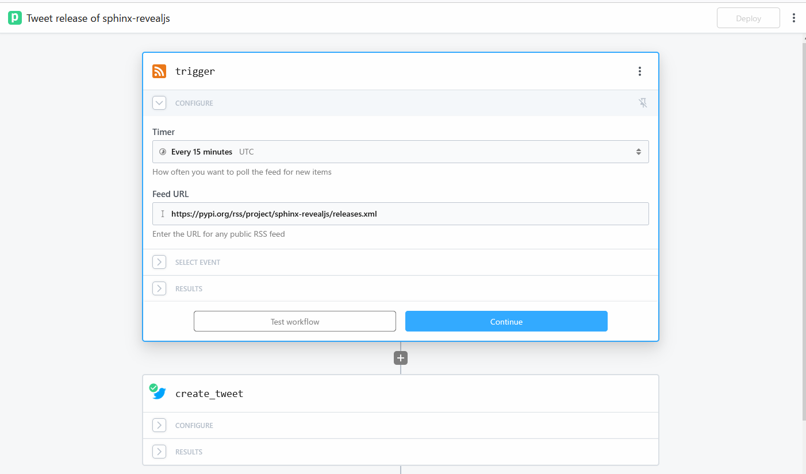
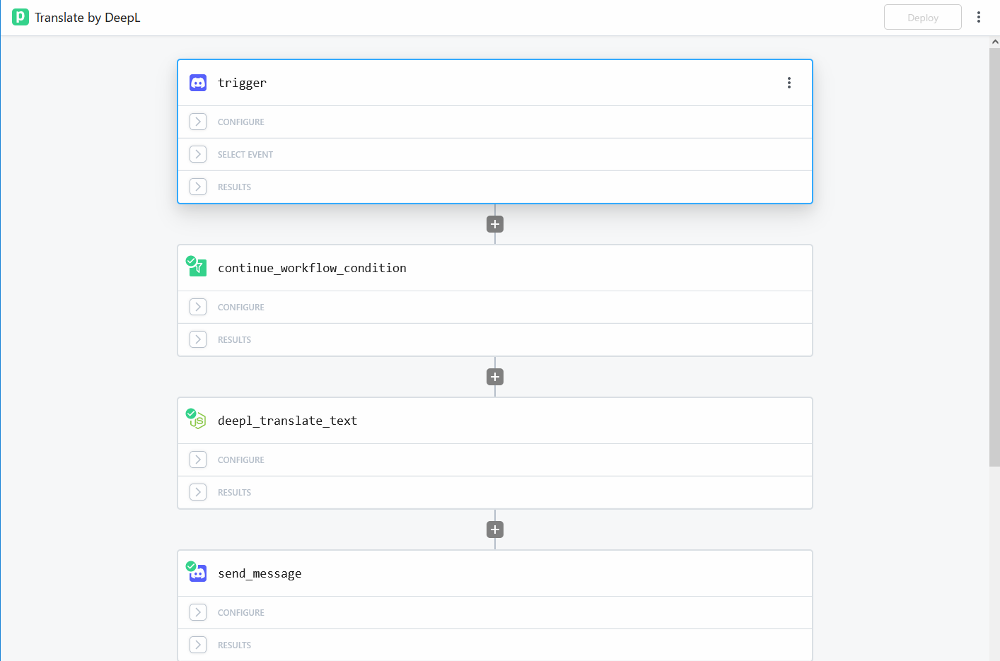
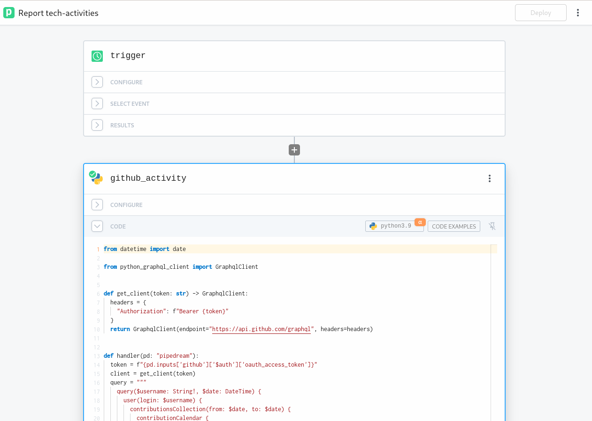
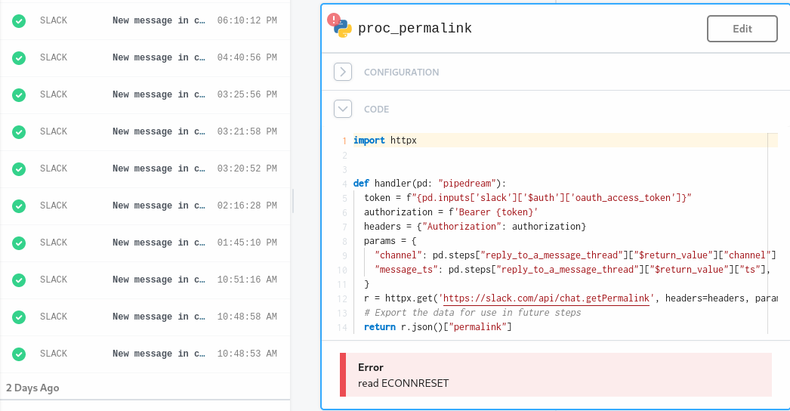

:og:image: _images/ogp/pyconjp-2022-lt/index.png
:og:description: PyCon JP 2022のアフターパーティー内で発表したLTの資料です

=================================================
PipedreamでPythonistaに優しい(?)ワークフロー構築R
=================================================

.. revealjs-slide::
    :conf: {"width":960,"height":720,"controls":true}
    :theme: css/pyconjp-2022-lt.css

:author: Kazuya Takei / @attakei
:date: 2022/10/15
:event: PyCon JP 2022 LT in Official Party
:hashtags: `#pyconjp <https://twitter.com/hashtag/pyconjp>`_

はじめに
========

LTの趣旨
--------

.. container:: r-fit-text

    Pipedreamを使ってみた/皆さん使ってみて。

お前誰よ
--------

.. figure:: https://attakei.net/_static/images/icon-attakei.jpg

Kazuya Takei / @attakei

* 趣味系Pythonista
* Sphinxでプレゼンテーションをしたがる人

Sphinxを通して考える、「拡張」の仕方
------------------------------------

見てくれた方、ありがとうございました。

.. oembed:: https://speakerdeck.com/attakei/first-approach-for-development-sphinx-extension

Pipedreamの話をします
=====================

Pipedream is 何
---------------

https://pipedream.com/

.. figure:: _images/pipedream-logo.svg

.. revealjs-break::

https://pipedream.com/

* ワークフローSaaS
* ワークフローって

  * 外部リソースなどをトリガーとして定義
  * トリガーに応じて順次アクションを実行

.. revealjs-break::

    「PyPI上にあるパッケージの更新情報をRSSから拾ってツイートする」例

Pipedreamのライバル
-------------------

* IFTTT
* Zapier
* Power Automate
* (他にもいろいろ)

ライバルとの違い？
------------------

アクションを自作出来る。（ ``deepl_〜`` は自作）

.. revealjs-break::

アクションを自作出来る。（実際の動き）

.. oembed:: https://www.youtube.com/watch?v=Y18v-HsxEAU
    :maxwidth: 640
    :maxheight: 480

カスタムコードの対応言語
------------------------

.. revealjs-fragments::

    * Node.js
    * Golang
    * Bash
    * **Python**

    .. container:: r-fit-text
    
        **Pythonistaに優しい！**

使用例
------

GitHubのアクティビティを集計するワークフローの一部

.. revealjs-break::

コード

.. literalinclude:: _code/github_activity.py
    :language: python

「GraphQLを使ってGitiHub APIからアクティビティを入手する」 **Pythonコード** を動かせる。

.. revealjs-break::

| Q
| ライブラリは？ ``requirements.txt`` みたいなものは無いの？

.. revealjs-fragments::

    | A
    | 標準ライブラリにないものをインポートしようとしたら、ライブラリ名とみなしてPyPIから取ってくるみたいです。（雑な理解で）

課題感
------

たまに意味不明な失敗する。

* 正しいコードでも、微妙な頻度で失敗する。
* アクションの実行環境周りに何かありそう。

.. revealjs-break::

他には、

* 「RSSの管理をしくじって、RSS全部取り直し？」からの
* 「RSSの全エントリーをトリガーにしてしまう」という大事件。

.. revealjs-fragments::

    => FBすれば改善されるかも？

END
===

ワークフローSaaSもPythonで！

無料プランあるし、無料プランでもカスタムコードは動かせます
