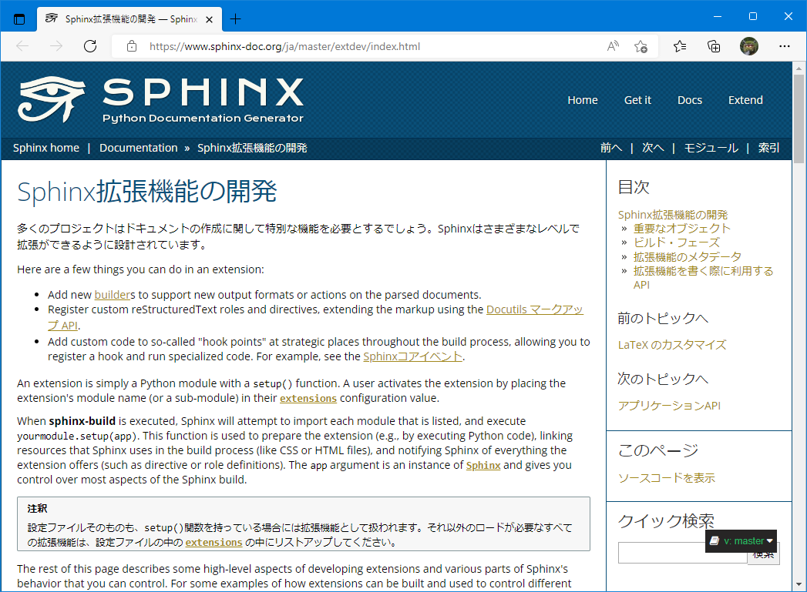

Not実装の話
===========

Sphinx拡張を実装するためには その0
----------------------------------

* その拡張に「何をさせたいか」をイメージする。
* 「させたいこと」の *5W1H* を整理し、分割する。
* *5W1H* にある拡張ポイントを抑える。
* 実装する。（前述）

.. revealjs-break::

`拡張のドキュメントを一読するとよい。 <https://www.sphinx-doc.org/en/master/extdev/index.html>`_

.. revealjs-break::

* 「拡張」に依存しないものは別立てすると良い。

  * 例：oEmbedのHTML取得はSphinx拡張である必要はない。
  * 最初は難しくとも、意識しておくだけで分割しやすくなる。

* 既存のSphinx拡張は、参考にする。

  * 基本的な処理フローは、Sphinx拡張である分には同じ…はず。
  * バンドルされた拡張を読むところから。

Sphinx拡張を実装するためには その-1
-----------------------------------

.. revealjs-fragments::

    * 「拡張する」ためには「拡張する動機」が必要。

      * 自分が使ったときの不満（推奨）
      * 他者が使ったときの不満

    * 拡張には「拡張の仕方を知る」=「Sphinxを知る」必要がある。
    * Sphinxを使い、ドキュメントを読むことが大事。
    * 「拡張かぶり」を意識しすぎない。

とあるOSSを拡張するためには
---------------------------

* 「拡張する」ためには「拡張する動機」が必要。

  * 自分が使ったときの不満（推奨）
  * 他者が使ったときの不満

* 拡張には「拡張の仕方を知る」=「とあるOSSを知る」必要がある。
* とあるOSSを使い、ドキュメントを読むことが大事。
* 「拡張かぶり」を意識しすぎない。

.. revealjs-fragments::

    **「ただ使う」より、ほんの一歩先を踏み込む。**

もし、OSSを拡張可能にするなら
-----------------------------

* （拡張する何かしらの魅力を持たせる）
* 「データの拡張」をしやすくする。
* 「イベント」の設計して、割り込みやすくする。
* 拡張ガイドとなるドキュメントを用意する。
